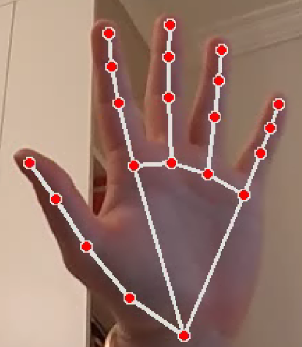
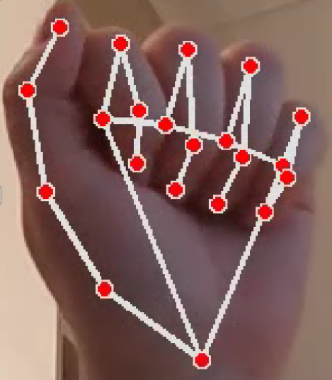
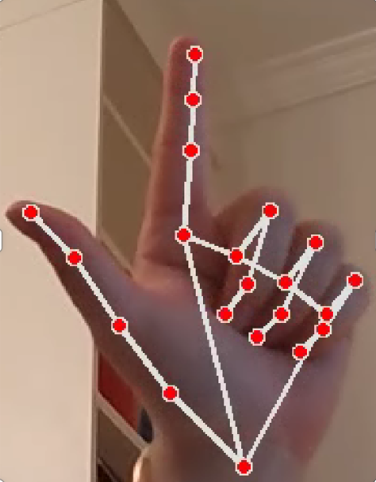
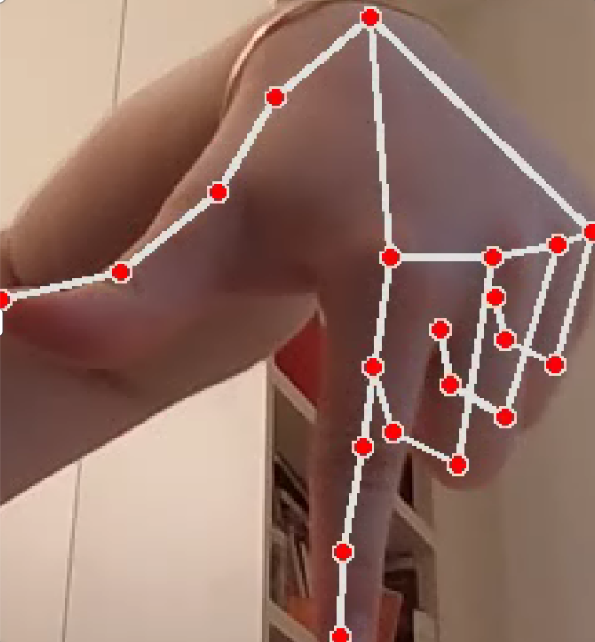
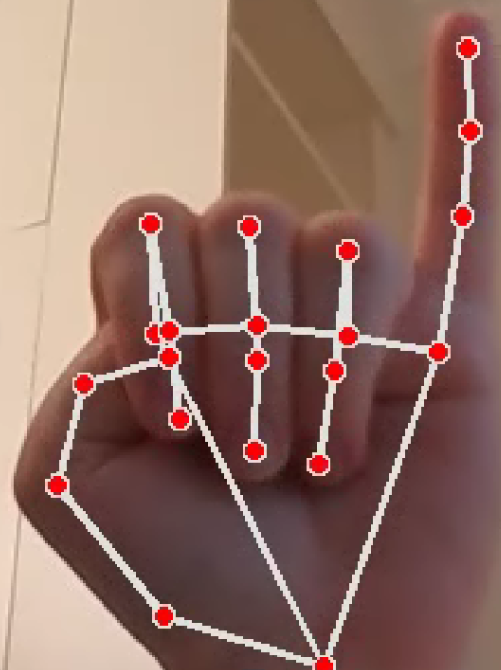
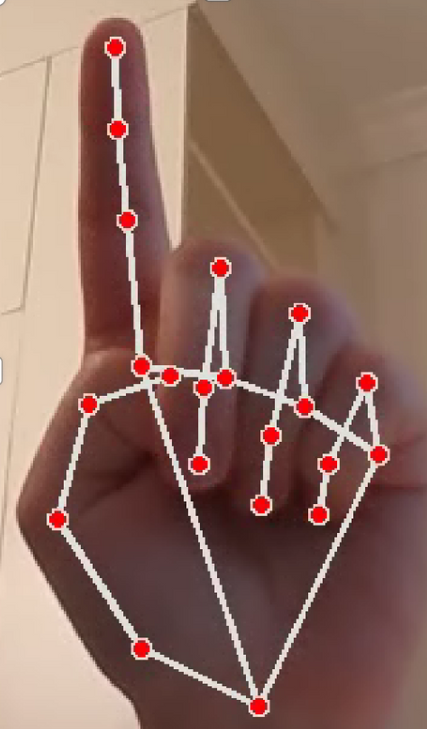
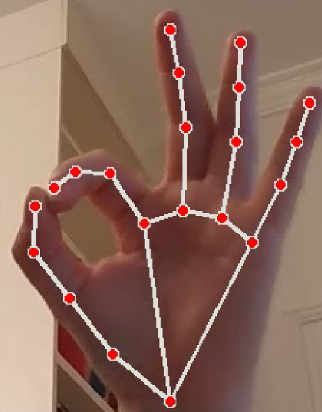
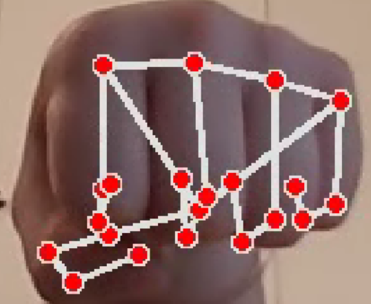
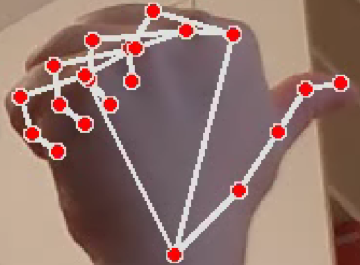
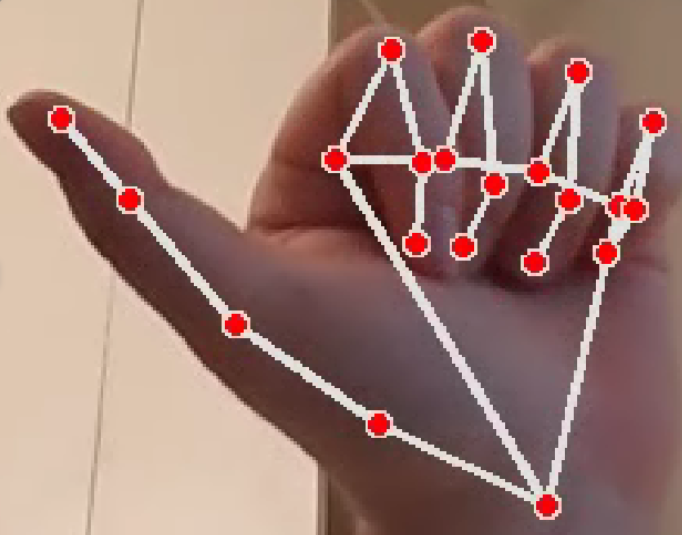

# Projet – Drone Interactif : Gestes et Couleurs

**Auteur :** Zeina Gebran – Josephine Bernard  
*Projet robotique – Télécom Paris – ENSTA / DJI Tello*

---

## Objectif

Développer un système autonome pour le drone 'DJI Tello' capable de :
* afficher sa caméra en temps réel
* réagir à des objets verts détectés par vision
* reconnaître des gestes humains simples
* explorer automatiquement en l'absence de stimulus
* assurer un atterrissage sécurisé

---

## Technologies utilisées

* Python 3.10+
* OpenCV – vision par ordinateur
* djitellopy – API pour DJI Tello
* NumPy
* MediaPipe – détection des gestes
* Flask + HTML – affichage vidéo en direct

---
## Fonctionnalités principales

### Détection d’objet vert
Détection de zones vertes via HSV et contours. Le drone ajuste sa position ou explore l’environnement s’il ne voit rien, puis atterrit si aucune détection prolongée.

### Détection de gestes humains
Reconnaissance de gestes via règles simples (V0) ou un modèle MLP entraîné (V1). Permet de contrôler le drone (décoller, atterrir, bouger, tourner).
La V1 permet l'ajout de nouvelles commandes.

#### ✋ Gestes reconnus

| Geste              | Image                                               | Action associée           |
|-------------------|-----------------------------------------------------|---------------------------|
| Décoller          |                      | Le drone décolle          |
| Atterrir          |                      | Le drone atterrit         |
| Haut              |                          | Le drone monte            |
| Bas               |                           | Le drone descend          |
| Reculer           |                       | Le drone recule           |
| Avancer           |                       | Le drone avance           |
| Rotation horaire  |             | Rotation vers la droite   |
| Rotation antihoraire |      | Rotation vers la gauche   |
| Droite            |                        | Le drone va à droite      |
| Gauche            |                        | Le drone va à gauche      |

### Sécurité
Surveillance du vol et de la batterie. Atterrissage automatique en cas de danger ou de perte de détection.

---

### Gestion automatisée de l'environnement Python

Pour faciliter la configuration et reproductibilité du projet deux éléments sont fournis: 

1. Un fichier requirements.txt que l'on peut installer via:
```bash
pip install -r requirements.txt
```
2. Un script de configuration automatique:
Ce script permet de créer un environnement virtuel dédié au projet, d'y installer les dépendances; il permet de s'assurer de la bonne mise à jour de l'environnement.

Pour le run faire: 
```bash
.\runProject.bat
```

---

### Lancement du projet

Par défaut, le projet démarre en mode détection d’objet vert avec suivi et atterrissage automatique:
```bash
python -m webstream.app
```

Pour activer la reconnaissance de gestes, il faut spécifier "gesture" comme argument au lancement.
```bash
python -m webstream.app gesture
```